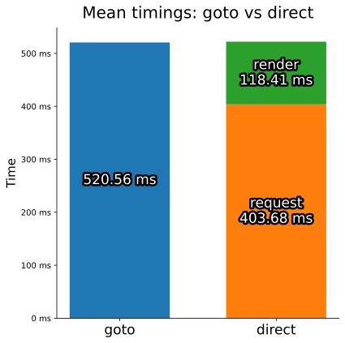

Interesting
===========

:py:meth:`~human_requests.session.Session.goto_page` vs :py:meth:`~human_requests.session.Session.request`
---------------------------------------------------------------------------------------------------------

With the same end goal, :py:meth:`~human_requests.session.Session.request` performs at least 20% faster.

However, if after using :py:meth:`~human_requests.session.Session.request` you need to call :py:meth:`~human_requests.abstraction.response.Response.render`,
the resulting speed will be the same as if you had used :py:meth:`~human_requests.session.Session.goto_page` from the start.

This is because the very first request in hand is intercepted and substituted when the browser makes the call.
In other words, the response is instantaneous since it does not actually go to the server.

.. note::

    In this example, the server’s response time is static and equals 400 ms.
