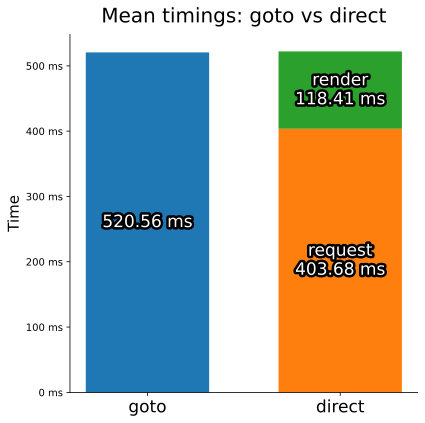

Interesting
===========

:py:meth:`~human_requests.human_page.HumanPage.goto` vs
:py:meth:`~human_requests.human_page.HumanPage.fetch`
-------------------------------------------------------

If your goal is only to get payload data (JSON/HTML bytes),
:py:meth:`~human_requests.human_page.HumanPage.fetch` is typically faster,
because it does not trigger a full page navigation lifecycle.

If you later need to execute page JS for that same payload,
use :py:meth:`~human_requests.human_page.HumanPage.goto_render` with the
already fetched response. In that scenario, total time is close to starting
with :py:meth:`~human_requests.human_page.HumanPage.goto`, but you still avoid
a duplicate upstream request.

This is because the first navigation request is intercepted and fulfilled from
local payload bytes.

.. note::

    In this example, the server response time is static and equals 400 ms.
